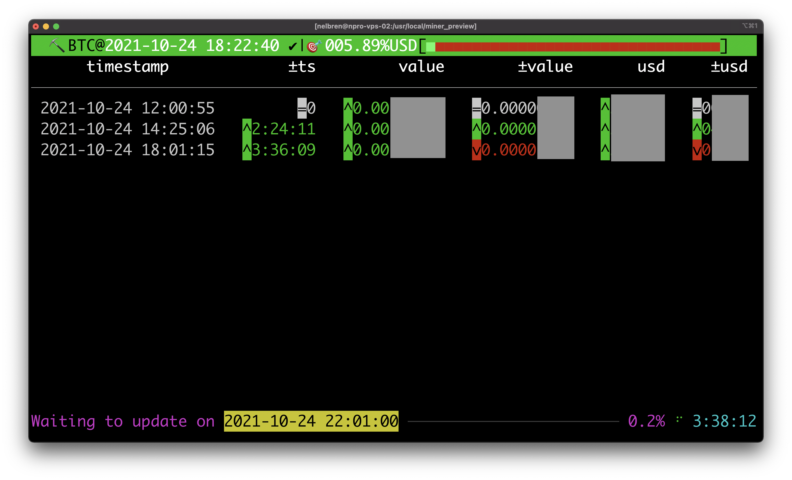

# ⛏️ miner_preview

### Get 💰 wallet 📈 balance from ☁️[Cloudatcost](https://www.cloudatcost.com/)  ⛏️ mining 🚧 process.

---

## 💻 Example of output


---

## 🔩 Install

1. **Get from github**

    - Clone the project
        ```bash
        git clone https://github.com/nelbren/miner_preview.git
        ```

2. **Configure your credentials**
    - Take a copy of config
        - 🚪 Windows
            ```bash
            copy secret.cfg.EXAMPLE .secret.cfg
            ```

        - 🐧 Linux | 🍎  Mac      
            ```bash
            cp secret.cfg.EXAMPLE .secret.cfg
            ```
    - Change the data inside of `.secret.cfg`
        |Key|Value|Description|
        |:--|:--|:--|
        |**USERNAME**|your username|Credentials of access|
        |**PASSWORD**|your password|Credentials of access|
        |**GOAL_USD**|amount of usd|Goal in dollars|
        |**GOAL_BTC**|amount of btc|Goal in bitcoin|

3. **Install python and modules**
    
    - Please install **python** and **pip**
    
    - Install modules
        ```bash
        install.bat.bash
        ```

4. **Run the script**
    ```bash
    python preview.py
    ```

5. **Feedback:** 
   - Send suggestions, comments, etc. to: nelbren@nelbren.com

---

### 🔜 **TODO:**
- [ ] 2FA functionality
- [ ] Graph from data
- [ ] Others reports