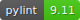

# ⛏️ miner_preview

[](https://python.org/)
[](https://github.com/psf/black)
[](https://pylint.org/)
[](https://en.cryptobadges.io/donate/0x0892c9b9b58ad5a7878d5dcd4da4ee72109c32c6)

### Get 💰 wallet 📈 balance from 💻[Ethermine](https://www.ethermine.org/) and ☁️[Cloudatcost](https://www.cloudatcost.com/) ⛏️ mining 🚧 process.

---
#### It shows the progress of mining in the amount obtained and the value of the coin at that moment, as well as the differences with the last update, it can also indicate progress goals in the amount of the coin and / or value in dollars. This information can be viewed interactively or added to a scheduled process to be carried out at specified times and then send the results to an email. 
---

## 💻 Usage

1. Mode: **Help** ( `./preview.py -h` )
   
2. Mode: **Interactive** ( `./preview.py` )
   
3. Mode: **Big** ( `./preview.py -b` )
      
4. Mode: **Graph** ( `./server.bash.bat` )
   
5. Mode: **Mail** ( `./preview.py -m` )
   
6. Mode: **Save** ( `./preview.py -s /tmp/OUTPUT` )
   
   **NOTE:** Is necessary the package: `wkhtmltopdf`

---

## 🔩 Install

1. **Get from github**

    - Clone the project
        ```bash
        git clone https://github.com/nelbren/miner_preview.git
        ```

2. **Configure your credentials**
    - Take a copy of config
        - 🚪 Windows
            ```bash
            copy secret.cfg.EXAMPLE .secret.cfg
            ```

        - 🐧 Linux | 🍎  Mac      
            ```bash
            cp secret.cfg.EXAMPLE .secret.cfg
            ```
    - Change the data inside of `.secret.cfg`

        - **ETHERMINE** (section)

            |Key|Value|Description|
            |:--|:--|:--|
            |**ADDRESS**|your eth address|Ethereum Address|
            |**GOAL_USD**|amount of usd|Goal in dollars|
            |**GOAL_ETH**|amount of eth|Goal in ethereum|

        - **CLOUDATCOST** (section)

            |Key|Value|Description|
            |:--|:--|:--|
            |**USERNAME**|your username|Credentials of access|
            |**PASSWORD**|your password|Credentials of access|
            |**CODE_2FA**|secret code 2FA|Credentials of access|
            |**GOAL_USD**|amount of usd|Goal in dollars|
            |**GOAL_BTC**|amount of btc|Goal in bitcoin|

        - **MAIL** (section)

            |Key|Value|Description|
            |:--|:--|:--|
            |**FROM**|your sender mail|The sender's email|
            |**TO**|your receive mail|The recipient's address|


3. **Install python and modules**
    
    - Please install **python** and **pip**
    
    - Install modules
        ```bash
        install.bash.bat
        ```

4. **Run the script**
    ```bash
    python3 preview.py
    ```

5. **Feedback:** 
   - Send suggestions, comments, etc. to: nelbren@nelbren.com

---
