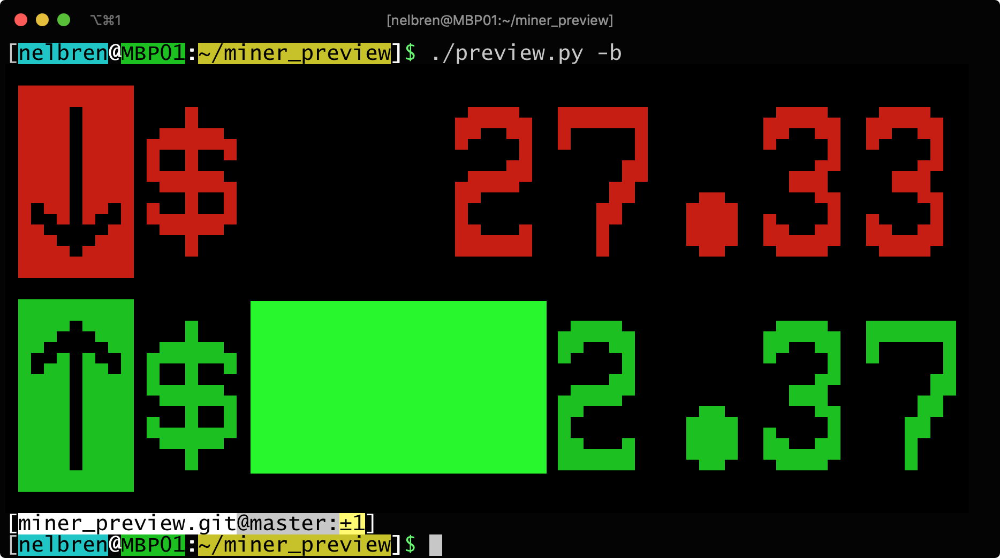

# ⛏️ miner_preview

[](https://python.org/)
[](https://github.com/psf/black)
[](https://pylint.org/)
[](https://www.flake8rules.com/)
[](https://en.cryptobadges.io/donate/0x0892c9b9b58ad5a7878d5dcd4da4ee72109c32c6)

### Get 💰 wallet 📈 balance from 💻[Ethermine](https://www.ethermine.org/), ☁️[Cryptoatcost](https://www.cryptoatcost.com/) and 💻[Nicehash](https://www.nicehash.com/) ⛏️ mining 🚧 process.

---
#### It shows the progress of mining in the amount obtained and the value of the coin at that moment, as well as the differences with the last update, it can also indicate progress goals in the amount of the coin and / or value in dollars. This information can be viewed interactively or added to a scheduled process to be carried out at specified times and then send the results to an ✉️ email or 🤖 telegram bot.
---

## 💻 [Usage](#usage)

1. Mode: 💡 **Help**
    - Command: `./preview.py -h`
    - Example: 
        
2. Mode: 💻 **Interactive** 
    - Command: `./preview.py -c`
    - Example:
        
3. Mode: 📺 **Big** 
    - Command: `./preview.py -c -b`
    - Example:
           
4. Mode: 📈 **Graph** 
    - Command: `./server.bash.bat`
    - Example:
        
5. Mode: 📷 **Save** 
    - Command: `./preview.py -c -s ~/OUTPUT`
    - Example:
        
    **NOTE:** You need to install the package: `wkhtmltopdf`
6. Mode: 📧 **Mail**
    - Command: `./preview.py -c -m`
    - Example:
        
7. Mode: 🤖 **Telegram Bot**
    - Command: `./preview.py -c -t`
    - Example:
        

---

## 🔩 Install

1. **Get from github**

    - Clone the project
        ```bash
        git clone https://github.com/nelbren/miner_preview.git
        ```
    - Update the project every so often
        ```bash
        git pull
        ```

2. **Configure the setup with your own credentials**
    - Take a copy of config
        - 🚪 Windows
            ```bash
            copy secret.cfg.EXAMPLE .secret.cfg
            ```

        - 🐧 Linux | 🍎  Mac      
            ```bash
            cp secret.cfg.EXAMPLE .secret.cfg
            ```
    - Change the data inside of file `.secret.cfg`

        - 💻 **ETHERMINE** (section)

            |Key|Value|Description|
            |:--|:--|:--|
            |**ADDRESS**|your eth address|Ethereum Address|
            |**GOAL_USD**|amount of usd|Goal in dollars|
            |**GOAL_ETH**|amount of eth|Goal in ethereum|

        - ☁️ **CRYPTOATCOST** (section)

            |Key|Value|Description|
            |:--|:--|:--|
            |**USERNAME**|your username|Credentials of access|
            |**PASSWORD**|your password|Credentials of access|
            |**CODE_2FA**|secret code 2FA|Credentials of access|
            |**GOAL_USD**|amount of usd|Goal in dollars|
            |**GOAL_BTC**|amount of btc|Goal in bitcoin|

        - 💻 **NICEHASH** (section)

            |Key|Value|Description|
            |:--|:--|:--|
            |**ORG**|your org|Credentials of access|
            |**KEY**|your key|Credentials of access|
            |**SECRET**|your secret|Credentials of access|
            |**GOAL_USD**|amount of usd|Goal in dollars|
            |**GOAL_BTC**|amount of btc|Goal in bitcoin|

        - ✉️ **MAIL** (section)

            |Key|Value|Description|
            |:--|:--|:--|
            |**FROM**|your sender mail|The sender's email|
            |**TO**|your receive mail|The recipient's address|

        - 🤖 **TELEGRAM** (section)

            |Key|Value|Description|
            |:--|:--|:--|
            |**TOKEN**|your telegram token|The token for use the bot|
            |**ID**|your telegram id|The id of bot|


3. **Install python and modules**
    
    - Please install **python** and **pip**
        - Python (https://www.python.org/downloads/)
        - Pip (https://pip.pypa.io/en/stable/installation/)
    
    - Install the required modules
        ```bash
        install.bash.bat
        ```

4. **Run the script**
    - Run the script through python
        ```bash
        python3 preview.py
        ```
    - Or run it directly
        ```bash
        ./preview.py
        ```
    - See the <a name="usage">Usage</a> described above 
     

5. **Feedback:** 
   - Send suggestions, comments, etc. to: nelbren@nelbren.com

---
